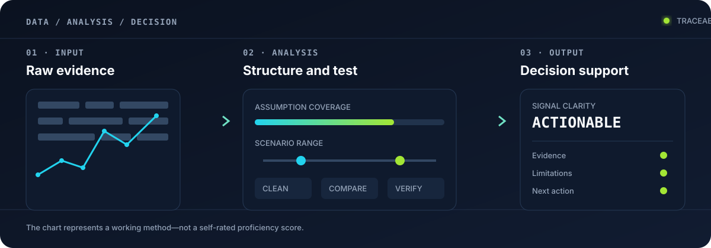
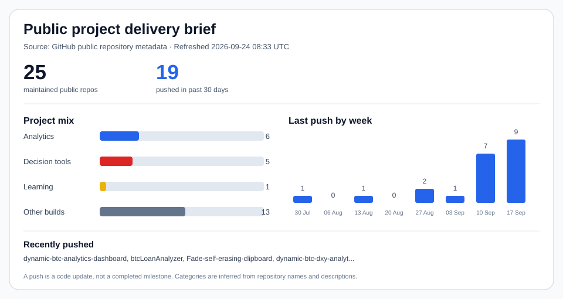

# Sirapob Dangpad

### Data Analyst · AI-Assisted Product Builder · Project Management Candidate

Bangkok, Thailand · [cryptotrvkc@gmail.com](mailto:cryptotrvkc@gmail.com) · [Portfolio](https://0xtrvkc.github.io/Portfolio/) · [Project archive](https://github.com/0xtrvkc?tab=repositories)

I turn unclear problems and messy data into structured analysis, understandable visuals, and usable decision-support tools.

I use AI as an implementation partner. My contribution is defining the problem, structuring the data and logic, specifying features, checking assumptions and calculations, testing the user experience, and deciding what should improve. I do not position myself as a traditional software engineer who manually writes every line of code.

I am interested in data analyst and project-oriented roles where I can investigate questions, communicate findings, coordinate requirements, and carry useful work from early definition through launch and improvement.

## How I turn data into decisions

A static local SVG with no scripts, external requests, or client-side chart rendering.

## What I can deliver

- Convert stakeholder needs and loosely defined ideas into scope, priorities, milestones, and acceptance criteria
- Break complex work into manageable releases while protecting the core user outcome
- Coordinate research, data, design, implementation, testing, documentation, and release activities
- Build clear dashboards and decision tools that make technical or financial information easier to act on
- Prepare and explore data, define useful KPIs, compare scenarios, and communicate findings visually
- Review calculations, edge cases, data assumptions, mobile behavior, and user flows before delivery
- Improve products iteratively from observed problems and user feedback
- Set up lightweight GitHub workflows for repeatable updates, checks, and deployments
- Communicate findings in plain English and Thai for technical and non-technical audiences
- Use AI-assisted development transparently to turn specifications and analysis into working prototypes

## Project delivery experience

### Independent Data, Project & Product Work

- Scope and deliver web-based tools from problem definition through testing, documentation, and release
- Manage a growing portfolio spanning market research, financial modelling, analytics, productivity, and education
- Design for desktop and mobile users, emphasizing transparent assumptions and explainable results
- Maintain projects after launch through bug fixes, workflow improvements, and new-data compatibility
- Use AI to accelerate implementation while retaining ownership of requirements, analytical logic, validation, and product decisions

## Selected project delivery

| Project | Problem addressed | What I delivered |
| --- | --- | --- |
| [BTC Grid Sandbox](https://0xtrvkc.github.io/btc-grid-sandbox/) | Grid returns can look profitable while inventory is underwater | A backtesting workspace focused on realized cash flow, open inventory, APR/APY, range behavior, and linked strategy inputs |
| [BTC Options Sandbox](https://0xtrvkc.github.io/btc-options-sandbox/) | Historical spot data does not directly explain Friday 0DTE range risk | A research product with configurable tests, breach analysis, historical cases, reporting modes, and documentation |
| [BTC Loan Analyzer](https://0xtrvkc.github.io/btcLoanAnalyzer/) | Collateral loans involve interacting price, LTV, repayment, and opportunity-cost decisions | A scenario modeller that makes trade-offs and outcomes visible |
| [Dynamic BTC Analytics](https://0xtrvkc.github.io/dynamic-btc-analytics-dashboard/) | Cycle and on-chain indicators are difficult to interpret together | A responsive dashboard combining MVRV, momentum, drawdown, crossover, and cycle views |
| [ARE YOU READY?](https://0xtrvkc.github.io/ARE-YOU-READY-/) | Trading knowledge differs sharply between beginners and advanced users | An adaptive assessment with learning routes, scoring, bilingual support, and answer-state management |
| [Fade](https://0xtrvkc.github.io/Fade-self-erasing-clipboard/) | Temporary notes and media become cluttered or persist too long | A manageable self-erasing clipboard with grouping, drag-and-drop, media handling, and responsive interaction |

## Project management strengths

| Area | Evidence from my work |
| --- | --- |
| Discovery & scope | Turn ambiguous ideas into explicit goals, constraints, inputs, outputs, and success conditions |
| Planning & prioritization | Separate essential releases from later enhancements and preserve requested constraints |
| Delivery ownership | Work across research, UX, implementation, validation, documentation, and release |
| Risk & quality | Check formulas, edge cases, data freshness, future-data behavior, and user-facing explanations |
| Stakeholder communication | Present complex material with clear language, structured reports, and beginner/advanced views |
| Continuous improvement | Revisit shipped products, diagnose friction, and deliver focused iterations |
| Automation | Use GitHub Actions and data-refresh workflows to reduce repetitive maintenance |

## Tools and working knowledge

**Data & analysis:** data preparation, exploratory analysis, scenario modelling, KPI definition, research synthesis, dashboard design, Google Sheets

**Delivery & product:** UX review, responsive design, testing, release iteration, GitHub, GitHub Actions

**AI-assisted technical work:** practical working knowledge of HTML, CSS, JavaScript, Python, Chart.js, Firebase, REST APIs, and data visualization

**Languages:** Thai (native) · English (working proficiency)

## Delivery snapshot

A concise portfolio view for quick stakeholder reporting. Metrics are generated from public repository and workflow data.

<!-- DELIVERY-SNAPSHOT:START -->

### Work in practice

| Work area | Example | What the product helps someone do |
| --- | --- | --- |
| Analytics & reporting | [dynamic-btc-analytics-dashboard](https://github.com/0xtrvkc/dynamic-btc-analytics-dashboard) | Combine cycle, momentum and drawdown views for interpretation |
| Scenario & risk tools | [btc-grid-sandbox](https://github.com/0xtrvkc/btc-grid-sandbox) | Compare grid cash flow, open inventory and range risk |
| Learning & assessment | [ARE-YOU-READY-](https://github.com/0xtrvkc/ARE-YOU-READY-) | Route beginner and advanced learners through an adaptive assessment |
| Productivity & workflows | [Fade-self-erasing-clipboard](https://github.com/0xtrvkc/Fade-self-erasing-clipboard) | Organize temporary content and control when it expires |

Updated 2026-09-24 11:47 UTC · Automation health means healthy or ready scheduled workflows among tracked production projects.
<!-- DELIVERY-SNAPSHOT:END -->

### Stakeholder visual

This view refreshes daily from public GitHub repository metadata. It shows maintained repositories, projects pushed in the past 30 days, project mix, and the week of each repository's latest push. The source and UTC refresh time appear on the visual. A push indicates code activity, not a completed milestone; categories are inferred from repository names and descriptions.

## Delivery operations

This table tracks scheduled refreshes for selected projects. Open a project link to inspect its workflows and runs; the status reflects the latest scheduled run.

<!-- WORKFLOW-TRACKER:START -->
| Project | Scheduled workflows | Latest run | Status |
| --- | --- | --- | --- |
| [Profile](https://github.com/0xtrvkc/0xtrvkc/actions) | 2 scheduled workflows | 2026-09-24 | Running |
| [BTC Loan Analyzer](https://github.com/0xtrvkc/btcLoanAnalyzer/actions) | 1 scheduled workflow | 2026-09-24 | Healthy |
| [Dynamic BTC Analytics](https://github.com/0xtrvkc/dynamic-btc-analytics-dashboard/actions) | 4 scheduled workflows | 2026-09-24 | Healthy |
<!-- WORKFLOW-TRACKER:END -->

## Recently updated projects

The latest public code pushes, refreshed every six hours. Each project links to its repository or live product.

<!-- RECENT-REPOS:START -->
| Project | What it helps with | Last code push |
| --- | --- | ---
| [dynamic-btc-analytics-dashboard](https://github.com/0xtrvkc/dynamic-btc-analytics-dashboard) | Interpret MVRV, cycles, and drawdowns | 2026-09-24 |
| [Fade-self-erasing-clipboard](https://github.com/0xtrvkc/Fade-self-erasing-clipboard) | Organize temporary notes and media | 2026-09-24 |
| [btcLoanAnalyzer](https://github.com/0xtrvkc/btcLoanAnalyzer) | Compare BTC-loan LTV and repayment paths | 2026-09-24 |
| [dynamic-btc-dxy-analytics-dashboard](https://github.com/0xtrvkc/dynamic-btc-dxy-analytics-dashboard) | Explore BTC and DXY analytics | 2026-09-24 |
| [BTC-Daily-Short-Call-Premium-Income-Checklist](https://github.com/0xtrvkc/BTC-Daily-Short-Call-Premium-Income-Checklist) | Review a daily BTC short-call checklist | 2026-09-24 |
| [Cony](https://github.com/0xtrvkc/Cony) | Cony | 2026-09-23 |
| [prop_challenge_simulator](https://github.com/0xtrvkc/prop_challenge_simulator) | Simulate prop-challenge risk and outcomes | 2026-09-22 |
| [btcEmaCrossBacktest](https://github.com/0xtrvkc/btcEmaCrossBacktest) | Test dual-EMA crossover strategies | 2026-09-22 |
| [quant-strategy-audit-workflow](https://github.com/0xtrvkc/quant-strategy-audit-workflow) | Quant strategy audit workflow | 2026-09-18 |
| [itd-oi-db](https://github.com/0xtrvkc/itd-oi-db) | Explore gold open interest and volatility | 2026-09-17 |
| [grid-bot-post-mortem](https://github.com/0xtrvkc/grid-bot-post-mortem) | Review bot cash flow and open inventory | 2026-09-16 |
| [pvd-vs-investment](https://github.com/0xtrvkc/pvd-vs-investment) | Compare provident-fund and investment paths | 2026-09-16 |
<!-- RECENT-REPOS:END -->

---

I build in public. Financial projects are research and educational tools, not investment advice.
