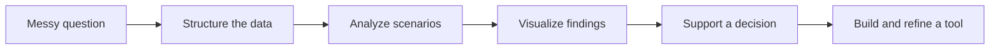
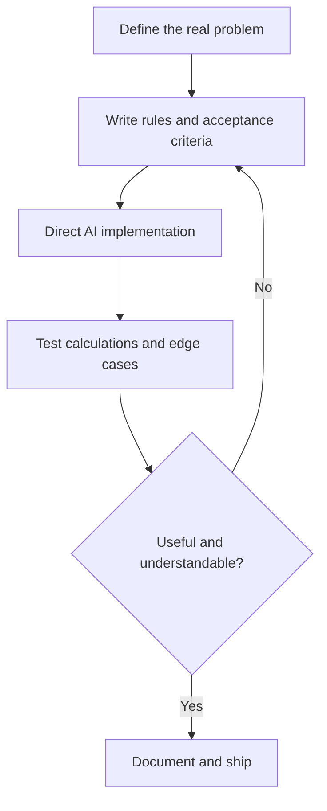

# Sirapob Dangpad

### Data Analyst · AI-Assisted Product Builder · Aspiring Project Manager

Bangkok, Thailand · [cryptotrvkc@gmail.com](mailto:cryptotrvkc@gmail.com)

I turn messy questions into understandable data, practical decisions, and working tools.

My projects are created through **AI-assisted development**. I provide the problem definition, domain logic, analytical approach, feature requirements, testing, and UX decisions; AI helps me implement and iterate. I do not position myself as a traditional software engineer.

---

## How I create value

| Area | What I contribute |
|---|---|
| Data analysis | Clean, structure, compare, and interpret data to answer practical questions |
| Visualization | Turn calculations and research into charts, dashboards, and decision-friendly summaries |
| Product thinking | Define the user problem, scope features, prioritize information, and simplify workflows |
| AI-assisted building | Direct AI implementation, inspect outputs, test edge cases, and iterate until the tool is useful |
| Project coordination | Break work into deliverables, document decisions, track changes, and communicate trade-offs |

## Analysis approach

I prefer analysis that makes its assumptions visible. A useful result should show where the data came from, what was calculated, what can go wrong, and what decision the result supports.

## Selected projects

| Project | Problem explored | My contribution |
|---|---|---|
| [Dynamic BTC Analytics Dashboard](https://github.com/0xtrvkc/dynamic-btc-analytics-dashboard) | Make cycle, valuation, momentum, and drawdown data easier to interpret | Analytical framework, dashboard structure, chart requirements, UX testing, and iterative validation |
| [BTC Options Sandbox](https://github.com/0xtrvkc/btc-options-sandbox) | Study historical BTC price ranges for Friday 0DTE research | Research rules, range logic, statistical requirements, interpretation, and risk-focused UX |
| [BTC Loan Analyzer](https://github.com/0xtrvkc/btcLoanAnalyzer) | Compare BTC-collateral loan outcomes across prices and repayment choices | Scenario definitions, financial logic, decision metrics, visualization direction, and testing |
| [BTC Grid Sandbox](https://github.com/0xtrvkc/btc-grid-sandbox) | Evaluate grid behavior, cash flow, and sensitivity to range settings | Model requirements, performance metrics, default scenarios, and usability decisions |
| [Fade: Self-Erasing Clipboard](https://github.com/0xtrvkc/Fade-self-erasing-clipboard) | Make temporary pasted content easier to organize and share | Product concept, interaction design, mobile requirements, testing, and feature iteration |

These repositories are best read as **working analytical products and experiments**, not claims that every line was written manually by me.

## Tools I work with

`Excel` · `Google Sheets` · `Data visualization` · `Dashboard design` · `Scenario modelling` · `Chart.js` · `HTML/CSS/JavaScript` · `GitHub Actions` · `AI-assisted development`

My coding knowledge is practical and growing. I am strongest at connecting the user problem, data, logic, presentation, and final decision.

## How I work with AI

AI accelerates implementation; it does not replace responsibility. I remain responsible for the requirements, assumptions, tests, interpretation, and final product decisions.

## What I am looking for

I am interested in opportunities where data analysis, product thinking, and project coordination overlap—especially roles where I can turn unclear requirements into structured work and communicate findings clearly to technical and non-technical teams.

---

Built through continuous learning, domain research, and transparent AI-assisted development.
